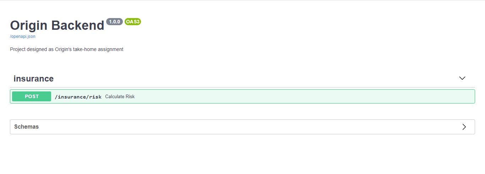

# Origin Backend Take-Home Assignment

This project was developed as an assignment for [Origin](https://www.useorigin.com/), based on the following [requirements](https://github.com/OriginFinancial/origin-backend-take-home-assignment). It consists of a REST API built using FastAPI that runs a simple Rules Engine to determine the user’s insurance risks from personal information like age, vehicle, and house.

## Run

To run use docker-compose:

```sh
docker-compose up
```

or build and run the container using:

```sh
docker build . -t origin-takehome
docker run -p 8000:8000 origin-takehome
```

## API Documentation

The Swagger UI Documentation is located at [http://127.0.0.1:8000/docs](http://127.0.0.1:8000/docs) and consists of a single endpoint.


### Insurance

This endpoint is responsible for receiving an input containing the user information, like:

```JSON
{
  "age": 35,
  "dependents": 2,
  "house": {"ownership_status": "owned"},
  "income": 0,
  "marital_status": "married",
  "risk_questions": [0, 1, 0],
  "vehicle": {"year": 2018}
}
```

And responding with risk scores for each insurance line as seen below:

```JSON
{
    "auto": "regular",
    "disability": "ineligible",
    "home": "economic",
    "life": "regular"
}
```

## Main Technical Decisions

### Rules Engine

The core of the project is its rules engine.

> "A business rules engine is a software system that executes one or more business rules in a runtime production environment." - [wiki](https://en.wikipedia.org/wiki/Business_rules_engine)

#### Some Alternatives

The naive approach to applying a series of rules to a piece of data stored as a UserInfo object, for example, would be a lot of ugly conditional logic. This, of course, wouldn't be extensible. To make it more extensible and maintainable, every if/else could belong to a method inside UserInfo, but it would violate the Single Responsibility and Open-Closed Principle (making it hard to extend).

#### Final Approach

The Rules Engine was build based on the behavioral pattern Chain of Responsibility where every rule is an object derived from the `BaseRule` class that can handle requests.


A `Rule` object has an `apply_rule(self, user_info, user_risk)` that handles the request by applying its own rules. To create a new rule simply create a new class extending `BaseRule` and add the rule to the chain. In this project, the chain is instantiated in `services.py`, and for readability, the pipe operator (or) was overloaded so that chaining can be written as below:

```python
import AgeOverSixty, AgeUnderThirty, AgeBetweenThirtyAndForty

rules = (AgeOverSixty()
         | AgeUnderThirty
         | AgeBetweenThirtyAndForty
        )
```

And rules are executed for a `UserInfoDTO` object, containing all the user information received. Using a `UserRisk` object to store the risks for insurance lines. As seen:

```python
base_risk = UserRisk(user_info)
risk = rules.apply_rule(user_info, base_risk)
```

### Risk Object

A `Risk` object stores the risks for every insurance line by setting its properties as `InsuranceRiskLine` objects. `InsuranceRiskLine` has two parameters: `risk` and `is_eligible` to store the risk points and eligibility of a given line. The implementation is located at [risk](./app/insurance/risk.py) inside the insurance module

### Testing endpoints

Each endpoint is tested end to end, provided input, and expecting an output. FastAPI generates a testing client which can be used to make requests.

### Unit Testing Rules

Even though endpoints are tested using input and output it still does not cover every rule. That's why rules are unit tested in this project. Every rule has its own test case inside `tests/test_rules`

## Adding a new rule

As mentioned above, new rules can be added by creating a new Rule class inside `app.insurance.rules` overriding the `apply_rule` method, for example:

```python
class NewRuleName(BaseRule):
    def apply_rule(self, user_info, user_risk):
        # {...} check conditions here
        # apply_rule for next Rule in chain
        return super().apply_rule(user_info, user_risk)
```

And add it to the chain inside `services`:

```python
def get_insurance_score(user_info):
    base_risk = UserRisk(user_info)
    rules = (AgeOverSixty()
             | AgeUnderThirty
             | AgeBetweenThirtyAndForty
             | HasDependents
             | HasMotgagedHouse
             | HasNoHouse
             | HasNoIncome
             | IncomeAboveTwoHundredK
             | IsMaried
             | HasNoVehicle
             | HasNewVehicle
             | NewRuleName # add it to the chain
             )
    risk = rules.apply_rule(user_info, base_risk)
    return risk.evaluate_lines()
```
